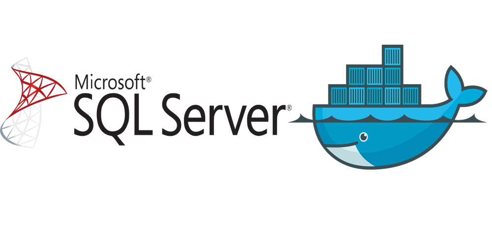

<div align="center" id="top"> 
  

  &#xa0;

</div>

<h1 align="center">Docker Sqlserver</h1>

<p align="center">
  

  

  

  


</p>

<!-- Status -->

<h4 align="center"> 
	🚧  Docker Sqlserver 🚀 Completo...  🚧
</h4> 

<hr> 

<p align="center">
  <a href="#dart-about">Sobre</a> &#xa0; | &#xa0; 
  <a href="#sparkles-features">Características</a> &#xa0; | &#xa0;
  <a href="#rocket-technologies">Tecnologias</a> &#xa0; | &#xa0;
  <a href="#white_check_mark-requirements">Requisitos</a> &#xa0; | &#xa0;
  <a href="#checkered_flag-starting">Iniciando</a> &#xa0; | &#xa0;
  <a href="#memo-license">Licença</a> &#xa0; | &#xa0;
  <a href="https://github.com/robsonamendonca" target="_blank">Autor</a>
</p>

<br>

## :dart: About ##

Como fazer com que o docker compose init um banco de dados do SQL Server

## :sparkles: Características ##

:heavy_check_mark: Docker necssário esta instalado;\
:heavy_check_mark: Alguma ferramenta para gestaõ de banco de dados (HeidiSQL);\
:heavy_check_mark: Script pode ser persoanalizado conforme sua necessida;

## :rocket: Tecnologias ##

As seguintes ferramentas foram utilizadas neste projeto:

- [Docker](https://www.docker.com/)
- [HeidiSQL](https://www.heidisql.com/download.php)

## :white_check_mark: Requisitos ##

Antes de iniciar :checkered_flag:, você precisa ter [Git](https://git-scm.com) e [Docker](https://www.docker.com/) instalado.

## :checkered_flag: Iniciando ##

```bash
# Clone este projeto
$ git clone https://github.com/robsonamendonca/docker-sqlserver

# Acessar a pasta
$ cd docker-sqlserver

# Criando contêiner 
$ docker-compose up -d

# Dados para se concectar:
host:  127.0.0.1
Username : SA
Password:  SqlServer2019!

```
Dica:
Se você alterar qualquer um dos scripts após a execução pela primeira vez, precisará fazer um docker-compose up --build para garantir que o contêiner seja criado novamente ou apenas usará seus scripts antigos.

## :memo: Licença ##

Este projeto está sob licença do MIT. Para mais detalhes, consulte o arquivo [LICENSE](LICENSE.md) .

[Baseado no artigo: SQL Server + Docker Compose: criando rapidamente ambientes e populando bases para testes](https://renatogroffe.medium.com/sql-server-docker-compose-criando-rapidamente-ambientes-e-populando-bases-para-testes-13d108d8cdb2) feito por: [Renato Groffe](https://github.com/renatogroffe)

Feito com :heart: por <a href="https://github.com/robsonamendonca" target="_blank">Robson Mendonça</a>

&#xa0;

<a href="#top">Voltar ao top</a>
